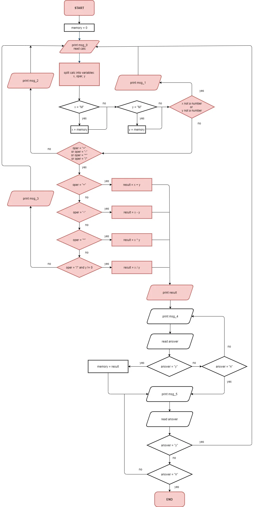

# Honest Calculator – Stage 3: Total recall

---

## 🧠 Description

Take a look at the upgraded flowchart. As before, the old blocks are red-colored. Be careful; some flows can now work differently.

---

## 🎯 Objectives

To complete this stage, you need to implement the flowchart above. While doing it, please, follow our recommendations below:

- Don't use the built-in functions to calculate from a string;
- The `memory` variable must be of a float type; use this variable to store intermediate result;
- There are no tests when `M` is negative. For example, there will be no test input like this: `-M + 6`;
- Copy two messages. The tests will check if the correct message appears in the correct order. Don't add extra lines or characters.

```text
msg_4 = "Do you want to store the result? (y / n):" 

msg_5 = "Do you want to continue calculations? (y / n):"
```

---

## 📌 Example

The greater-than symbol followed by a space (`>`) represents the user input.

Example 1:

```text
Enter an equation
> 3 + 3
6
Do you want to store the result? (y / n):
>y
Do you want to continue calculations? (y / n):
>y
Enter an equation
> 5 + M
11
Do you want to store the result? (y / n):
>y
Do you want to continue calculations? (y / n):
>n
```
