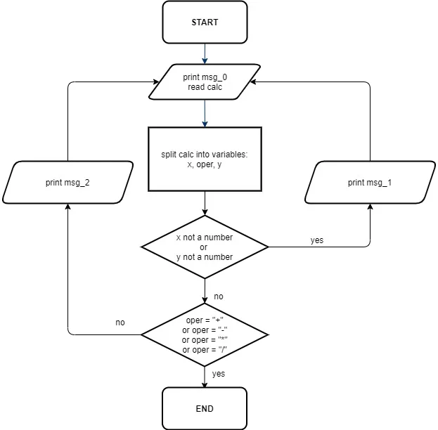

# Honest Calculator – Stage 1: Minefield Display

---

## 🧠 Description

We will start by implementing the flowchart below. Copy the messages carefully and assign them to the program variables. It makes no difference whether you make a list or each message is a separate variable. The appropriate messages must be displayed according to the flowchart.

---

## 🎯 Objective (Stage 1)

Implement the flowchart above. Please, follow our recommendations:

- The variable calc should have the following format: `x operation y`. For example: `2 + 3`, `2 + g` or `3.1 r 5`;
- The variables `x` and `y` must be of the `float` or `int` type. The `oper` variable is a one-character string. Check whether the passed values have proper types. The delimiter must be a dot;
- Copy the messages below carefully. The tests will check if the correct message appears in the correct order. Please, do not add extra lines or characters.

```text
msg_0 = "Enter an equation"

msg_1 = "Do you even know what numbers are? Stay focused!"

msg_2 = "Yes ... an interesting math operation. You've slept through all classes, haven't you?"
```

---

## 📌 Example

The greater-than symbol followed by a space (`>`) represents the user input.

```text
Enter an equation
> 2 + m
Do you even know what numbers are? Stay focused!
Enter an equation
> 3 n 3
Yes ... an interesting math operation. You've slept through all classes, haven't you?
Enter an equation
> m - 2
Do you even know what the numbers are? Stay focused!
Enter an equation
> 4.7 * 5.2

