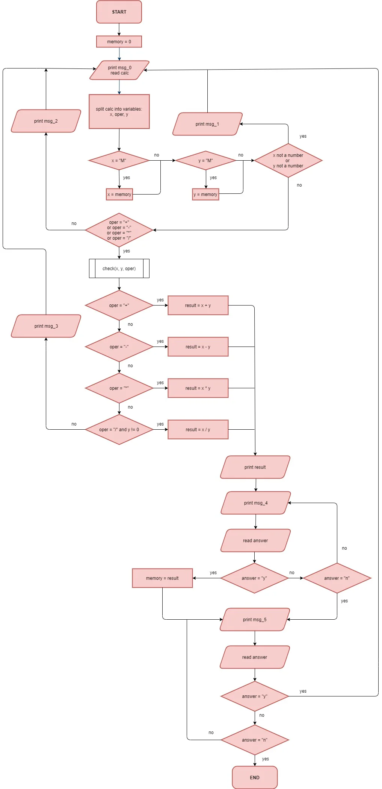
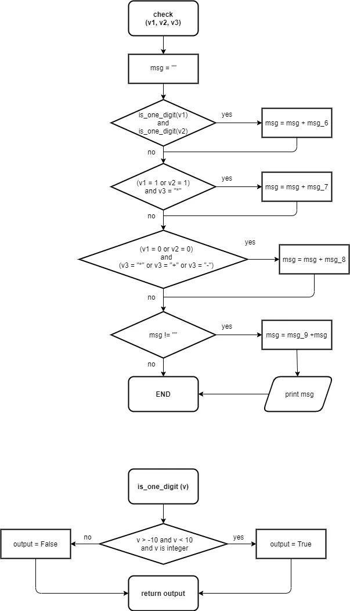

# Honest Calculator – Stage 4: The laziness test

---

## 🧠 Description

Implement the flowchart below. Take a good look — there're two functions. The old blocks are in red. Be careful; some flows can now work differently.


Functions:



---

## 🎯 Objectives

Implement the flowchart with two functions. Please, mind the recommendations below:

- Don't use the built-in functions to calculate from a string
- Notice that the function `is_one_digit()` is supposed to check whether it has an integer value in the mathematical sense, e.g. 3.0 is an integer, 3.1 is a non-integer number. Thus, do NOT check the type of variable, but the number itself.
- Copy the messages carefully. The tests will check if the correct message appears in the correct order. Don't add extra lines or characters.

```text
msg_6 = " ... lazy"

msg_7 = " ... very lazy"

msg_8 = " ... very, very lazy"

msg_9 = "You are"
```

---

## 📌 Example

The greater-than symbol followed by a space (`>`) represents the user input.

Example 1:

```text
Enter an equation
> 2 / M
You are ... lazy
Yeah... division by zero. Smart move...
Enter an equation
> 1 * M
You are ... lazy ... very lazy ... very, very lazy
0.0
Do you want to store the result? (y / n):
> n
Do you want to continue calculations? (y / n):
> y
Enter an equation
> 899 * 0
You are ... very, very lazy
0.0
Do you want to store the result? (y / n):
> n
Do you want to continue calculations? (y / n):
> n
```
